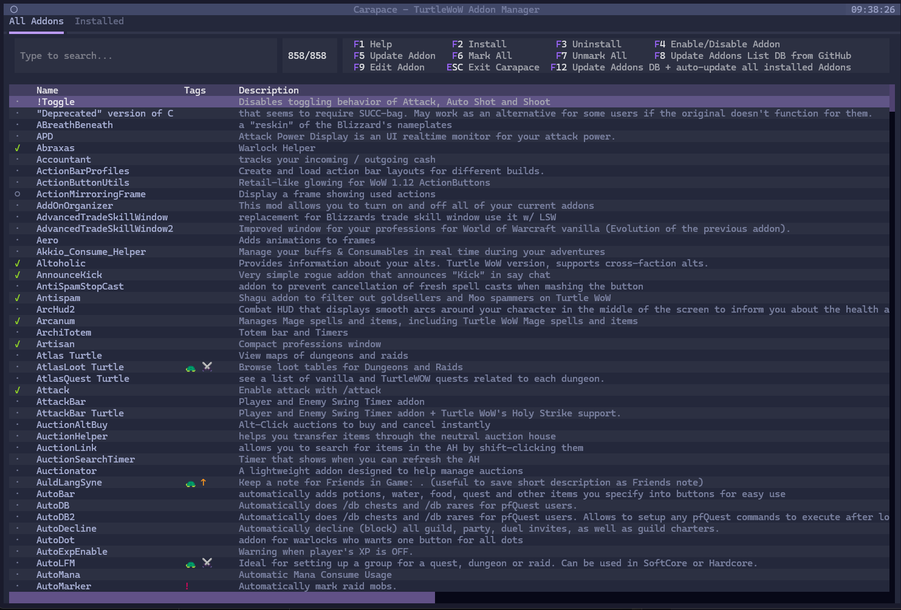
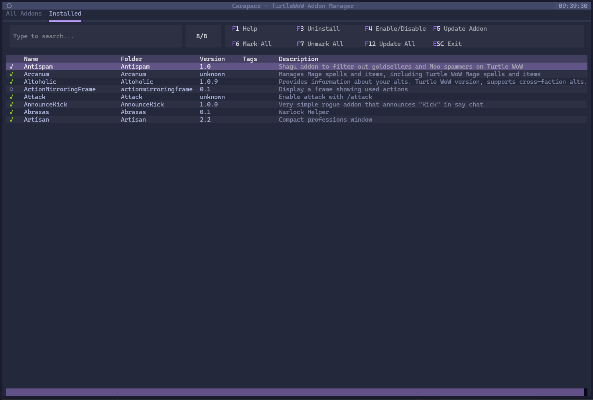

<div align="center">


**Lightning-fast addon management with Git-powered updates, beautiful TUI, and powerful CLI**

[](LICENSE)
[](https://github.com/mikl0s/carapace)
[](https://www.python.org/)
[](https://turtle-wow.org)

[Features](#-features) • [Quick Start](#-quick-start) • [CLI](#-command-line-interface) • [Documentation](#-documentation) • [Contributing](#-contributing)



</div>

---

## ✨ Features

<table>
<tr>
<td width="50%">

### 🎨 **Beautiful TUI**
- **Tokyo Night** theme by default
- **Instant search** - just start typing
- **Tabbed interface** 
- **Visual feedback** with indicators
- **Smart marking** batch operations

</td>
<td width="50%">

### ⚡ **Powerful Backend**
- **Git-based** installation with junctions
- **Smart sync** from TurtleWoW wiki
- **Enable/disable** without uninstalling
- **Override URLs** for custom repos
- **Automatic updates** with F12

</td>
</tr>
<tr>
<td width="50%">

### 🛠️ **Full CLI Support**
- **Install/remove** addons from terminal
- **Batch operations** with patterns
- **JSON output** for scripting
- **Profile management** (coming soon)
- **Scriptable API** for automation

</td>
<td width="50%">

### 🔒 **Smart & Safe**
- **Auto-updates** - App and database updates from GitHub
- **Pre-populated database** - 858 addons ready on first run
- **Preserves edits** during wiki sync
- **Junction-based** - no file duplication
- **Non-destructive** operations

</td>
</tr>
</table>

## 🚀 Quick Start

### Prerequisites

- **Windows** 10/11 (Windows 7 compatible)
- **Python** 3.11+ 
- **Git** (for addon installation)
- **TurtleWoW** or vanilla WoW client

### Installation

```bash
# Clone the repository
git clone https://github.com/mikl0s/carapace.git
cd carapace

# Install dependencies
pip install -r requirements.txt

# Launch the TUI
python -m carapace.tui
```

## 🖥️ Terminal User Interface

### Keyboard Shortcuts

<details>
<summary><b>All Addons Tab</b></summary>

| Key | Action | Description |
|-----|--------|-------------|
| **Any Letter** | Search | Auto-focuses search field |
| **Enter** | Install | Quick install with confirmation |
| **Space** | Mark | Select for batch operations |
| **Tab** | Switch Tab | Navigate between tabs |
| **F1** | Help | Show help screen |
| **F2** | Install Marked | Batch install |
| **F3** | Uninstall Marked | Batch remove |
| **F4** | Enable/Disable | Toggle addon state |
| **F5** | Update | Update selected addon |
| **F6** | Mark All | Select all visible |
| **F7** | Unmark All | Clear selection |
| **F8** | Sync Wiki | Update from TurtleWoW |
| **F9** | Edit | Modify addon details |
| **F12** | Update All | Sync + update installed |
| **ESC** | Exit | Close application |

</details>

<details>
<summary><b>Installed Tab</b></summary>

| Key | Action | Description |
|-----|--------|-------------|
| **F3** | Uninstall | Remove selected |
| **F4** | Enable/Disable | Toggle state |
| **F5** | Update | Git pull latest |
| **F6** | Mark All | Select all |
| **F7** | Unmark All | Clear selection |
| **F12** | Update All | Update all installed |

</details>

## 💻 Command Line Interface

Carapace provides a full-featured CLI for automation and scripting:

### Basic Commands

```bash
# Install an addon
python -m carapace install pfQuest

# Remove an addon
python -m carapace remove pfQuest

# Update addons
python -m carapace update pfQuest
python -m carapace update --all

# Enable/disable without removing
python -m carapace disable pfQuest
python -m carapace enable pfQuest

# Check for Carapace updates
python -m carapace self-update --check
python -m carapace self-update

# Update addon database from GitHub
python -m carapace update-db
```

### Advanced Usage

```bash
# List addons with filters
python -m carapace list --installed
python -m carapace list --tag "Class"
python -m carapace list --search "quest"

# Batch operations
python -m carapace install pfQuest BigWigs KTM
python -m carapace remove --pattern "^DBM-*"

# JSON output for scripting
python -m carapace list --json | jq '.[] | select(.installed == true)'

# Set custom repository
python -m carapace config --addon pfQuest --repo https://github.com/custom/repo

# Sync from wiki
python -m carapace sync
```

### Profiles (Coming Soon)

```bash
# Create profiles for different characters
python -m carapace profile create warrior
python -m carapace profile switch mage
python -m carapace profile list
```

## 🏗️ Architecture

### Directory Structure

```
Interface/AddOns/
├── .repos/                    # Git repositories (hidden)
│   ├── pfQuest/              # Full git repo
│   └── BigWigs/              # Full git repo
├── pfQuest → .repos/pfQuest  # Junction (like symlink)
└── BigWigs → .repos/BigWigs  # Junction
```

### How It Works

1. **Git Clone** → Addons cloned to `.repos/` folder
2. **Junction Creation** → Windows junctions link to `AddOns/`
3. **Enable/Disable** → Add/remove junctions without deleting
4. **Updates** → Simple `git pull` in `.repos/`
5. **No Duplication** → Single source of truth

## 📊 Database

SQLite database at `%APPDATA%\Carapace\app.db`:

- **Soft deletes** - Never lose data
- **Override URLs** - Custom repo support
- **Event logging** - Full audit trail
- **Tag system** - Categorized addons
- **Settings** - User preferences

## 🎯 Key Features

### Auto-Update System
- **Application updates** - Automatic notification and one-click update
- **Database updates** - Pre-populated 858 addons, auto-downloads on first run
- **Version checking** - Checks GitHub for latest releases
- **Self-update command** - `carapace self-update` to upgrade

### Git-Powered Updates
- Clone once, update forever
- Bandwidth efficient
- Version history available
- Rollback capability

### Smart Wiki Sync
- Checks revision before updating
- Preserves manual edits
- Lightweight API calls
- Automatic tag merging

### Junction System
- No file duplication
- Instant enable/disable
- Clean uninstalls
- Space efficient

## 🤝 Contributing

We welcome contributions! See [CONTRIBUTING.md](CONTRIBUTING.md) for guidelines.

### Development

```bash
# Run tests
python -m pytest tests/

# Check code style
python -m black carapace/
python -m ruff check carapace/

# Build executable (coming soon)
python -m pyinstaller carapace.spec
```

## 📈 Performance

- **858 addons** load in < 1 second
- **Instant search** with no delay
- **Batch operations** handle 100+ addons
- **Minimal memory** footprint

## 🐛 Debug Mode

Debug logs are automatically created:

```powershell
# Find latest log
Get-ChildItem tui_debug_*.log | Sort-Object LastWriteTime -Descending | Select-Object -First 1

# View log
Get-Content (Get-ChildItem tui_debug_*.log | Sort-Object LastWriteTime -Descending | Select-Object -First 1)
```

## 📚 Documentation

- [Installation Guide](docs/INSTALLATION.md)
- [User Manual](docs/USER_MANUAL.md)
- [CLI Reference](docs/CLI_REFERENCE.md)
- [API Documentation](docs/API.md)
- [Project Status](docs/PROJECT_STATUS.md)

## 🙏 Acknowledgments

- **TurtleWoW Community** - For the amazing vanilla+ experience
- **[Textual](https://github.com/Textualize/textual)** - Beautiful TUI framework
- **[Tokyo Night](https://github.com/enkia/tokyo-night-vscode-theme)** - Gorgeous theme
- **Contributors** - Everyone who has helped improve Carapace

## 📜 License

MIT License - See [LICENSE](LICENSE) for details

---

<div align="center">

**Made with 💚 for the TurtleWoW Community**

*Slow and steady wins the raid* 🐢

[Report Bug](https://github.com/mikl0s/carapace/issues) • [Request Feature](https://github.com/mikl0s/carapace/issues) • [Wiki](https://github.com/mikl0s/carapace/wiki)

</div>